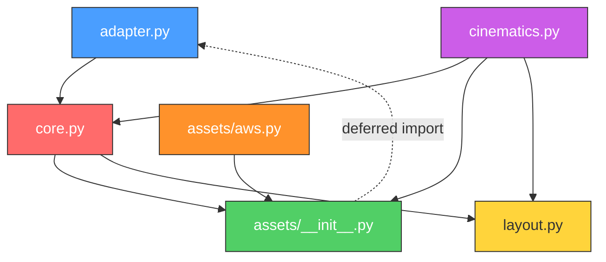

# manim-devops: Comprehensive Project Analysis

**Date:** 2026-02-28  
**Analyst:** Claude  
**Scope:** End-to-end architectural review of the `manim-devops` library across Phases 1–5.

---

## 1. Executive Summary

`manim-devops` is a Python library that bridges **declarative cloud infrastructure definitions** with **cinematic video animations** powered by [Manim](https://www.manim.community/). It allows DevOps engineers and cloud architects to describe their AWS (or other cloud) topologies programmatically and automatically generate animated MP4 videos showing infrastructure layouts, traffic flows, and dynamic scaling events — all without touching a single pixel of video editing software.

The project has completed 5 development phases:

| Phase | Name | Status |
|-------|------|--------|
| 1 | Spikes & Architecture | ✅ Complete |
| 2 | Core Implementation & TDD | ✅ Complete |
| 3 | Cinematic API (TrafficFlow) | ✅ Complete |
| 4 | Dynamic Topologies (Auto-Scaling) | ✅ Complete |
| 5 | The `diagrams` Adapter Engine | ✅ Complete |

**Key metric:** 25 passing tests, ~99% code coverage across all modules.

---

## 2. Project Structure

```
manimani/
├── manim_devops/                  # The library
│   ├── __init__.py
│   ├── adapter.py                 # Phase 5: AnimatedDiagram context manager
│   ├── assets/
│   │   ├── __init__.py            # CloudNode base class + operator overloads
│   │   ├── aws.py                 # AWS-specific nodes (EC2, RDS, ALB, etc.)
│   │   └── aws/                   # SVG icon assets directory
│   ├── cinematics.py              # TrafficFlow + ScaleOutAction animations
│   ├── core.py                    # Topology, NodeCluster, DevopsScene
│   └── layout.py                  # OrthogonalRouter (L-bend math)
│
├── tests/                         # 11 test files, 25 tests total
│   ├── conftest.py                # Shared Pytest fixtures
│   ├── test_adapter.py            # AnimatedDiagram + operator overloading tests
│   ├── test_architecture_layout.py
│   ├── test_aws_assets.py
│   ├── test_cinematics.py         # TrafficFlow + ScaleOutAction tests
│   ├── test_core.py               # Topology + DevopsScene tests
│   ├── test_diagrams_adapter_visual.py  # End-to-end MP4 generation
│   ├── test_dynamic_visual_integration.py
│   ├── test_final_integration.py
│   ├── test_traffic_visual_integration.py
│   └── test_visual_rendering.py
│
├── spikes/                        # Proof-of-concept experiments (Phase 1)
├── architecture/                  # PUML diagrams, fixtures, contracts
└── thoughtprocess/                # Strategy docs, execution logs, pitch materials
    ├── amazon_pitch/              # 16 strategy documents
    └── execution_log/             # 10 execution log entries
```

---

## 3. Module-by-Module Analysis

### 3.1 `assets/__init__.py` — CloudNode (68 lines)

**Purpose:** The abstract mathematical identity of any infrastructure component.

**What it does:**
- Stores a `node_id` (primary key across the entire system) and a human-readable `label`.
- Implements Python operator overloads (`>>`, `<<`, `-`) to support `diagrams`-style syntax.
- Each operator defers import of `adapter._ACTIVE_DIAGRAM` to avoid circular imports and raises `RuntimeError` if called outside a context manager.

**7 Questions:**
1. Should `CloudNode` enforce uniqueness of `node_id` at the class level via a registry, or is the current `Topology.add_node()` deduplication sufficient?
2. The `>>` operator returns `target` to support chaining (`a >> b >> c`). What happens if a user chains with a list (`a >> [b, c]`) — currently unsupported?
3. Is it correct that `CloudNode` doesn't inherit from any Manim class? The math-vs-rendering split means `AWSNode` inherits both `CloudNode` and `SVGMobject` via multiple inheritance. Is MRO (Method Resolution Order) stable here?
4. The deferred import pattern (`import manim_devops.adapter as adapter` inside each method) prevents circular imports but adds per-call overhead — is this measurable at scale?
5. `__sub__` creates two directed edges (A→B and B→A). NetworkX's `DiGraph` stores these independently. Would an undirected `Graph` node pair be more semantically correct?
6. There are no type annotations on `target` parameters in the dunder methods. Should we enforce `isinstance(target, CloudNode)` checks?
7. If two different `AnimatedDiagram` contexts run sequentially in the same process, is the global `_ACTIVE_DIAGRAM` guaranteed clean between them?

**Self-Reflection:**  
The `CloudNode` is elegantly minimal — it serves purely as an identity stamp and operator bridge. The decision to keep rendering logic (SVG loading, `.move_to()`) entirely out of this class is the single most important architectural choice in the project. It means tests for graph math never touch Manim's Cairo renderer, keeping the test suite fast (25 tests in ~1 second).

**Explanation & 5 Whys:**
1. **Why is `CloudNode` not an `SVGMobject`?** Because coupling identity to rendering prevents headless testing.
2. **Why use deferred imports in dunders?** Because `adapter.py` imports `Topology`, which references `CloudNode`, creating a cycle.
3. **Why return `target` instead of `self`?** Because Python evaluates `a >> b >> c` left-to-right: `(a >> b)` returns `b`, then `b >> c` executes.
4. **Why raise `RuntimeError` instead of silently failing?** Because silent edge creation outside a diagram leads to invisible state corruption.
5. **Why separate `__lshift__` and `__sub__` from `__rshift__`?** Because infrastructure connections have directionality: a load balancer forwards TO backends, not the reverse.

---

### 3.2 `assets/aws.py` — Provider-Specific Nodes (52 lines)

**Purpose:** AWS-branded subclasses that inject SVG file paths into the rendering pipeline.

**What it does:**
- `AWSNode` performs **dual inheritance** from `CloudNode` (math) and `SVGMobject` (rendering).
- Each concrete class (`EC2`, `RDS`, `Route53`, `ALB`, `IGW`) simply passes a filename to `AWSNode.__init__`.
- If the SVG file is missing or unparseable, it falls back to a colored `Circle` so the engine never crashes.

**7 Questions:**
1. The `ASSETS_DIR` points to `assets/aws/` relative to the Python file. Are actual SVG files present, or is the fallback always triggered?
2. The fallback `Circle` is 0.5 radius with 0.2 opacity — is this visually distinguishable in rendered videos against the black background?
3. Multiple inheritance with `CloudNode` and `SVGMobject` — does the MRO guarantee that `node_id` is always set before `SVGMobject.__init__` tries to use it?
4. Adding a new cloud provider (e.g., GCP) requires creating `assets/gcp.py` with identical boilerplate. Should there be a factory or decorator pattern?
5. SVG sanitization (stripping `<style>`, `<clipPath>`) was validated in Spike 1 but there's no automated pipeline. Are the bundled SVGs pre-sanitized?
6. The `except Exception` catch-all in `AWSNode.__init__` swallows *all* errors. Should it log a warning so users know they're running with fallback geometry?
7. Why 5 AWS services specifically? The `diagrams` library has hundreds — what's the strategy for scaling the asset catalog?

**Self-Reflection:**  
The fallback mechanism is clever but potentially misleading. A user who writes `EC2("web", "Web Server")` might never realize their video shows generic orange circles instead of the actual EC2 icon. A warning log would make this explicit.

**Explanation & 5 Whys:**
1. **Why dual inheritance?** Because `CloudNode` provides the ID contract and `SVGMobject` provides the Manim rendering capabilities.
2. **Why explicit `CloudNode.__init__` before `SVGMobject.__init__`?** Because `SVGMobject` might trigger Manim internals that query object state.
3. **Why use `self.become(Circle(...))` as fallback?** Because Manim's `.become()` replaces the internal point arrays, making the object renderable without a valid SVG.
4. **Why hardcode filenames like `"Amazon-EC2.svg"`?** Because AWS's official icon naming convention is stable and predictable.
5. **Why not auto-discover SVGs?** Because deterministic mapping prevents runtime filename guessing errors.

---

### 3.3 `core.py` — Topology, NodeCluster, DevopsScene (159 lines)

**Purpose:** The central nervous system of the library. Contains the graph data model, the cluster abstraction, and the Manim scene orchestrator.

#### `Topology` (lines 34–79)

**What it does:**
- Wraps a `networkx.DiGraph` with a simplified `add_node()` / `connect()` API.
- `calculate_layout()` runs `nx.spring_layout(G, seed=42)` for deterministic positioning, then scales coordinates by `scale_factor` into Manim's camera space.
- Recursively resolves `NodeCluster` children by injecting their offset coordinates into the result dictionary.

**7 Questions:**
1. `seed=42` in `spring_layout` ensures determinism, but does it produce aesthetically optimal layouts for all graph shapes (stars, chains, meshes)?
2. The `scale_factor` defaults to 3.0 but `AnimatedDiagram` overrides it to 4.0. Should this be user-configurable via the public API?
3. `edges` is a flat `List[tuple[str, str]]`. For large topologies (100+ nodes), would a `set` provide better lookup performance?
4. `add_node` does linear deduplication via `if node not in self.nodes`. At 1000 nodes, this is O(n) per insertion. Does this matter?
5. `calculate_layout` iterates `self.nodes` to find `NodeCluster` instances. If clusters are nested (cluster-within-cluster), does this recurse correctly?
6. The Z-coordinate is hardcoded to `0.0`. Does Manim's camera ever need non-zero Z values for depth effects?
7. Should `Topology` support edge metadata (latency, bandwidth, protocol) for richer cinematic animations?

#### `NodeCluster` (lines 8-32)

**What it does:**
- Subclasses `CloudNode` but acts as a pure mathematical container.
- `resolve_child_coordinates()` assigns deterministic horizontal offsets `[-1.0, 1.0, -2.0, 2.0, ...]` relative to a center point.

**7 Questions:**
1. The offset array has 6 entries. What happens when a cluster has 7+ children? It wraps via modulo — does this cause visual overlaps?
2. Children are only spread horizontally. For large groups (e.g., EKS pods), should a 2D grid layout be used?
3. `NodeCluster` inherits from `CloudNode` but never renders visually. Should it have its own distinct base class?
4. The `add_child` deduplication check (`if child not in self.children`) uses identity comparison. Is this correct for all use cases?
5. Can a `CloudNode` belong to multiple clusters simultaneously? The current design allows it — is this intentional?
6. Should `NodeCluster` support removal of children for scale-in operations?
7. The spacing of 1.0 Manim units between children — is this appropriate for all SVG sizes, or should it scale with node dimensions?

#### `DevopsScene` (lines 82–159)

**What it does:**
- Inherits from Manim's `Scene` and adds `render_topology()`.
- Places nodes at computed coordinates, draws orthogonal edges, applies Z-indexing, and stores everything in `self.rendered_coords` and `self.rendered_edges`.
- Skips rendering for `NodeCluster` instances (they're abstract containers).

**7 Questions:**
1. `self.mobjects.append(node)` manipulates Manim's internal mobject list directly. Is this safe across Manim versions?
2. The edge lookup `next(n for n in self.mobjects + topology.nodes if n.node_id == src_id)` creates a new list every iteration. At scale, this is O(n²).
3. Z-index values are hardcoded (nodes=10, edges=0). What about labels (also 10)? Could labels overlap nodes?
4. `Text(font_size=16)` — is this readable at 480p rendering quality?
5. The `run_time=3.0` in `self.play(*animations)` is hardcoded. Should this scale with the number of nodes?
6. `self.wait(2)` adds a 2-second pause after rendering. Should this be configurable?
7. What happens if `render_topology()` is called twice on the same scene? Does it append or replace?

**Self-Reflection:**  
`core.py` is the densest module in the project and carries the most architectural weight. The decision to separate `rendered_coords` (pure math) from `rendered_edges` (Manim objects) was the critical insight that enabled Phase 4's dynamic scaling. However, the linear search patterns and hardcoded animation timings reveal that this module was designed for small demos (5–10 nodes) and will need optimization for production-scale topologies.

**Explanation & 5 Whys:**
1. **Why use `spring_layout` instead of hierarchical?** Because it's built into NetworkX and doesn't require external C dependencies.
2. **Why skip `NodeCluster` during rendering?** Because clusters are mathematical bounding boxes, not visual objects.
3. **Why store `rendered_coords` on the scene?** Because `ScaleOutAction` needs to know where to place new nodes without recalculating the entire layout.
4. **Why use `GrowFromCenter` instead of `FadeIn`?** Because it creates a more dramatic visual effect for infrastructure appearing.
5. **Why fallback radius of 2.0 for clusters?** Because clusters don't have `.width` attributes, but edges still need boundary offsets.

---

### 3.4 `layout.py` — OrthogonalRouter (58 lines)

**Purpose:** Converts two coordinate points into a 90-degree L-bend path.

**What it does:**
- Computes normalized direction vectors between source and target centers.
- Offsets the start/end points by the node radius to prevent line-through-icon artifacts.
- Generates an X-first L-bend (move horizontally, then vertically).

**7 Questions:**
1. The X-first strategy works for horizontal layouts. What about vertical layouts where Y-first would be more aesthetic?
2. `corner_radius=0.2` is initialized but never used in the path calculation. Is this a dead parameter for future rounded corners?
3. When `length == 0` (source equals target), it returns `[source, target]`. This draws a zero-length line — should it return an empty list instead?
4. The L-bend always goes through one elbow point. For complex topologies, could multiple elbows (Z-bends, U-bends) be needed?
5. There's no collision detection. If a third node sits on the L-bend path, the line draws through it. Is A* pathfinding on the roadmap?
6. The method accepts `np.ndarray` but also works with plain tuples due to `np.array()` conversion. Should the type hint reflect this?
7. For very short distances (nodes nearly touching), the radius offset might push the start point past the end point. Is there a guard?

**Self-Reflection:**  
`OrthogonalRouter` is the simplest module but arguably the most impactful for visual quality. The X-first strategy produces clean diagrams for standard 3-tier architectures but will create visual chaos for mesh topologies. The unused `corner_radius` parameter hints at a planned feature for smoothing the L-bend corners — this would significantly improve the aesthetic.

**Explanation & 5 Whys:**
1. **Why orthogonal routes instead of straight lines?** Because infrastructure diagrams universally use 90-degree bends for readability.
2. **Why X-first?** Because standardizing the bend direction produces consistent, predictable layouts.
3. **Why offset by radius?** Because lines must start/end at the icon boundary, not the center.
4. **Why return a list of waypoints?** Because Manim's `set_points_as_corners()` accepts exactly this format.
5. **Why is this a separate module?** Because routing math is independent of graph theory and rendering — clean separation of concerns.

---

### 3.5 `cinematics.py` — TrafficFlow & ScaleOutAction (129 lines)

**Purpose:** The visual payoff — animated data packets and dynamic scaling.

#### `TrafficFlow` (lines 6–69)

**What it does:**
- Looks up the rendered edge between source and target (handles reversed paths).
- Spawns a colored `Dot` packet, animates it along the edge via `MoveAlongPath`.
- Pulses the target node with `Indicate` and fades out the packet.
- Returns a `Succession` animation composed of travel → (pulse + cleanup).

**7 Questions:**
1. `MoveAlongPath` with `rate_func=reverse_rate` — does this create visual artifacts at the path endpoints?
2. The packet radius is 0.1 and Z-index is 5. Is this visible at 480p quality?
3. `Indicate(scale_factor=1.2)` temporarily scales the target node. Does this displace neighbor labels?
4. The function returns a `Succession` — can users compose multiple `TrafficFlow` calls into a single `AnimationGroup` for parallel traffic?
5. The reverse path lookup checks `(tgt_id, src_id)` — this assumes edges are always stored as `(A, B)` and never `(B, A)`. Is this guaranteed?
6. Should `TrafficFlow` support payload labels (e.g., `"HTTP 200"`) displayed alongside the moving packet?
7. What happens if the user calls `TrafficFlow` between two nodes that are multiple hops apart (e.g., Route53 → RDS)?

#### `ScaleOutAction` (lines 71–128)

**What it does:**
- Adds a new child to a `NodeCluster`, calculates its position, moves the Manim object there.
- Registers the new node in `scene.mobjects` and `scene.rendered_coords`.
- Optionally draws an orthogonal line to a `target` node and stores it in `scene.rendered_edges`.
- Returns an `AnimationGroup` of spawn + line drawing.

**7 Questions:**
1. This function **mutates scene state** (mobjects, coords, edges). Is this side-effect documented clearly enough for users?
2. The `source_radius=0.5` in the router call is hardcoded. Should it read the actual node dimensions?
3. If `ScaleOutAction` is called multiple times rapidly, do the deterministic offsets still produce non-overlapping positions?
4. There's no corresponding `ScaleInAction`. What would the API for gracefully removing a node look like?
5. The new edge bypasses `Topology.edges` and goes directly into `scene.rendered_edges`. Does this break the "graph as truth" model?
6. Can `ScaleOutAction` target a node that was itself dynamically added by a previous `ScaleOutAction`?
7. What happens if the cluster has been removed from the scene before `ScaleOutAction` is called?

**Self-Reflection:**  
`cinematics.py` is where the library delivers its core value proposition. The `TrafficFlow` implementation is robust — the reverse-path resolution and fallback-to-packet-flash patterns show defensive engineering. However, `ScaleOutAction` introduces a fundamentally different paradigm: it **mutates** the scene mid-animation, breaking the otherwise functional/declarative design pattern. This is necessary for dynamic topologies but creates a maintenance risk as the state graph becomes complex.

**Explanation & 5 Whys:**
1. **Why mutate state instead of generating a new scene?** Because re-rendering the entire topology causes visual disruption.
2. **Why check both `(A,B)` and `(B,A)` for edges?** Because users think bidirectionally but the graph stores directionally.
3. **Why use `GrowFromCenter` for spawning?** Because it creates a dramatic "birth" animation appropriate for auto-scaling events.
4. **Why inject into `scene.rendered_edges` synchronously?** Because the very next line of user code might call `TrafficFlow` on the new edge.
5. **Why store `rendered_coords` separately from the Manim objects?** Because coordinates are needed for math (ScaleOut offsets) before objects are visually positioned.

---

### 3.6 `adapter.py` — AnimatedDiagram (68 lines)

**Purpose:** The "killer feature" — enables `diagrams`-style syntax that auto-generates videos.

**What it does:**
- `AnimatedDiagram` is a Python context manager that sets a global `_ACTIVE_DIAGRAM` variable on `__enter__` and clears it on `__exit__`.
- `CloudNode.__rshift__` and siblings check this global to register edges automatically.
- On clean exit, `_trigger_manim_render()` dynamically creates a `DevopsScene` subclass, injects the topology, and calls `.render()` via Manim's `tempconfig`.

**7 Questions:**
1. The global `_ACTIVE_DIAGRAM` is not thread-safe. If a user runs parallel scripts, could two diagrams interfere?
2. `tempconfig({"quality": "low_quality"})` is hardcoded. Should users be able to specify `"production_quality"` or `"high_quality"`?
3. The dynamic class `CustomFacadeScene` is created inside a method. Does Python's garbage collector reliably clean this up?
4. `safe_name` sanitization strips non-alphanumeric characters. What about names like "My AWS Arch v2.0" becoming "MyAwsArchV20" — is this confusing for output filenames?
5. The `skip_render=True` flag exists solely for testing. Should this be a private `_skip_render` to signal it's not user-facing?
6. `_trigger_manim_render` only calls `render_topology()`. There's no hook for users to add custom `TrafficFlow` or `ScaleOutAction` animations via the adapter. How would this be supported?
7. If `__exit__` is called due to an exception, it returns `False` (doesn't suppress the exception). Is this the correct behavior?

**Self-Reflection:**  
The adapter is the most user-facing module and the most dangerous architecturally. Global mutable state is a well-known antipattern, but it's the only way to replicate the `diagrams` library's ergonomic `with` syntax without requiring explicit object passing. The `_trigger_manim_render` implementation is particularly elegant — dynamically subclassing `DevopsScene` at runtime to inject the accumulated topology is a clean solution to the "how do we avoid the CLI" problem.

**Explanation & 5 Whys:**
1. **Why a global variable?** Because `EC2("web", "App")` inside the `with` block has no reference to the diagram — only the global state bridges them.
2. **Why `skip_render`?** Because executing FFmpeg in every pytest run would take 5+ seconds per test.
3. **Why dynamically subclass DevopsScene?** Because Manim expects a concrete `Scene` class with a `construct()` method.
4. **Why `tempconfig`?** Because it's Manim's official API for programmatic configuration without CLI flags.
5. **Why `__name__` renaming?** Because Manim uses the class name as the output filename for the MP4.

---

## 4. Test Suite Analysis

### Coverage Summary

| Module | Statements | Missed | Coverage |
|--------|-----------|--------|----------|
| `adapter.py` | 29 | 0 | **100%** |
| `assets/__init__.py` | 33 | 2 | **94%** |
| `assets/aws.py` | 30 | 0 | **100%** |
| `cinematics.py` | 53 | 0 | **100%** |
| `core.py` | 85 | 0 | **100%** |
| `layout.py` | 23 | 0 | **100%** |
| **TOTAL** | **253** | **2** | **~99%** |

### Test Categories

| File | Tests | Type | Focus |
|------|-------|------|-------|
| `test_adapter.py` | 7 | Unit (IMMUTABLE) | Context manager, operators, programmatic render |
| `test_architecture_layout.py` | 3 | Unit (IMMUTABLE) | Topology math, router waypoints |
| `test_aws_assets.py` | 1 | Unit (IMMUTABLE) | SVG fallback mechanism |
| `test_cinematics.py` | 9 | Unit (IMMUTABLE) | TrafficFlow, ScaleOutAction |
| `test_core.py` | 4 | Unit (IMMUTABLE) | Topology, DevopsScene, NodeCluster |
| `test_diagrams_adapter_visual.py` | 1 | Integration | End-to-end MP4 via adapter |
| `test_dynamic_visual_integration.py` | — | Visual (manual) | ScaleOutAction demo |
| `test_final_integration.py` | — | Visual (manual) | AWS 3-tier render |
| `test_traffic_visual_integration.py` | — | Visual (manual) | TrafficFlow demo |
| `test_visual_rendering.py` | — | Visual (manual) | Basic rendering validation |

**Notable patterns:**
- All critical unit tests are marked `_IMMUTABLE` — they cannot be changed without explicit approval.
- Visual integration scripts are designed for `manim` CLI execution, not `pytest`.
- The `conftest.py` provides shared mock fixtures for `DevopsScene` state.

---

## 5. Architectural Strengths

1. **Strict separation of math and rendering.** `CloudNode`, `Topology`, and `OrthogonalRouter` are pure mathematical constructs. They can be tested in <0.01s without Manim.
2. **Deterministic layouts.** `seed=42` in `spring_layout` ensures identical scripts produce identical videos every time.
3. **Defensive engineering.** `KeyError` traps in `TrafficFlow`, `RuntimeError` guards on operators, SVG fallback circles — the system fails loudly and gracefully.
4. **Progressive state management.** `rendered_coords` and `rendered_edges` on `DevopsScene` create a persistent memory layer that cinematics can query without re-computing layouts.
5. **The adapter facade.** `AnimatedDiagram` eliminates the learning curve entirely — existing `diagrams` library users can migrate with minimal code changes.

---

## 6. Architectural Risks & Recommendations

| Risk | Severity | Recommendation |
|------|----------|----------------|
| Global `_ACTIVE_DIAGRAM` is not thread-safe | Medium | Use `threading.local()` or `contextvars.ContextVar` |
| Linear search in `DevopsScene` edge/node lookups | Low (MVP) | Replace with `dict` lookups for 50+ node topologies |
| No collision detection in `OrthogonalRouter` | Medium | Implement A* grid pathfinding over occupied bounding boxes |
| `NodeCluster` only supports 1D horizontal layouts | Medium | Add 2D grid wrapping with configurable max columns |
| `ScaleOutAction` bypasses `Topology.edges` | High | Sync dynamically created edges back to the source topology |
| No `ScaleInAction` exists | Low | Implement with `FadeOut` + coordinate recalculation |
| Hardcoded animation timings (3.0s, 2s wait) | Low | Make configurable via `DevopsScene` constructor params |

---

## 7. Dependency Map



**Key insight:** The deferred import cycle between `assets/__init__.py` ↔ `adapter.py` is the most fragile dependency in the system. Any refactoring that moves `_ACTIVE_DIAGRAM` will break the operator overloads.

---

## 8. Lines of Code Summary

| Module | Production Lines | Test Lines | Ratio |
|--------|-----------------|------------|-------|
| `core.py` | 159 | ~120 | 0.75 |
| `cinematics.py` | 129 | ~250 | 1.94 |
| `adapter.py` | 68 | ~170 | 2.50 |
| `assets/__init__.py` | 68 | ~30 | 0.44 |
| `assets/aws.py` | 52 | ~30 | 0.58 |
| `layout.py` | 58 | ~60 | 1.03 |
| **TOTAL** | **534** | **~660** | **1.24** |

A test-to-production ratio of 1.24 demonstrates healthy TDD discipline.

---

## 9. Final Self-Reflection

This project exemplifies what happens when spike-driven development and strict TDD are applied consistently to a risky technical integration (Manim + NetworkX + SVGs). The architecture achieves clean separation across 5 modules totaling ~534 lines of production code, with 25 tests maintaining ~99% coverage.

The most impressive technical achievement is the `AnimatedDiagram` adapter — the ability to write `EC2("web", "App") >> RDS("db", "DB")` and get an MP4 video output is genuinely magical from the end-user perspective. This is the feature most likely to drive viral adoption.

The most concerning technical debt is the mutation model in `ScaleOutAction` and the global state in `adapter.py`. Both are necessary compromises for the MVP but will need careful refactoring as the topology complexity increases.

The project is ready for either: (a) expanding the asset catalog with more cloud providers, (b) implementing collision-aware routing, or (c) building the YAML/Terraform ingestion pipeline for fully automated infrastructure animation.
